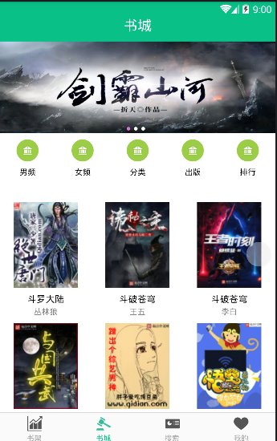
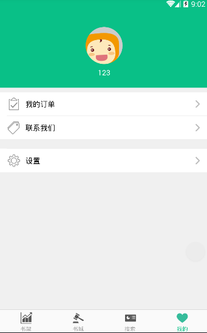
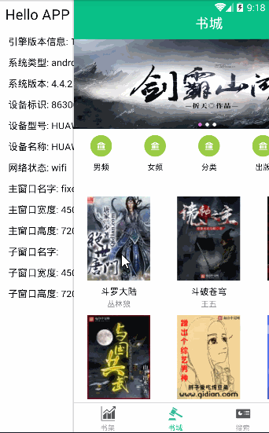

# reader

[](https://github.com/UsingMisz/reader/#license)
[](https://www.javascript.com)


### Introdution

apicloud 图书阅读 ，UI参考 微信小程序 阅读界面 

A grace open source reader-ui which following the weixin-ui. 
### Screenshots



### Gif Preview



### Features

- dot.js解析整个页面
- 页面： 登录  主显示页面 查询页面 订单页面 个人设置页面 等。

### Thanks

Thanks to these projects and libraries:

- Library : [dot.js](https://github.com/olado/doT) 、 [AndroidSlidingUpPanel](https://github.com/umano/AndroidSlidingUpPanel)等等


### End

> 注意：此开源项目仅做学习交流使用，如果你觉得不错，对你有帮助，欢迎点个fork，star，follow，也可以帮忙分享给你更多的朋友，这是给我们最大的动力与支持。

### Contact Me

- Github: github.com/UsingMisz
- Email: zzy747608835@gmail.com

### License

```
MIT License

Copyright (c) 2018 zzy

Permission is hereby granted, free of charge, to any person obtaining a copy
of this software and associated documentation files (the "Software"), to deal
in the Software without restriction, including without limitation the rights
to use, copy, modify, merge, publish, distribute, sublicense, and/or sell
copies of the Software, and to permit persons to whom the Software is
furnished to do so, subject to the following conditions:

The above copyright notice and this permission notice shall be included in all
copies or substantial portions of the Software.

THE SOFTWARE IS PROVIDED "AS IS", WITHOUT WARRANTY OF ANY KIND, EXPRESS OR
IMPLIED, INCLUDING BUT NOT LIMITED TO THE WARRANTIES OF MERCHANTABILITY,
FITNESS FOR A PARTICULAR PURPOSE AND NONINFRINGEMENT. IN NO EVENT SHALL THE
AUTHORS OR COPYRIGHT HOLDERS BE LIABLE FOR ANY CLAIM, DAMAGES OR OTHER
LIABILITY, WHETHER IN AN ACTION OF CONTRACT, TORT OR OTHERWISE, ARISING FROM,
OUT OF OR IN CONNECTION WITH THE SOFTWARE OR THE USE OR OTHER DEALINGS IN THE
SOFTWARE.

```
